# Introduction 


In Wareville, families prepare for SOC-mas when strange network activity causes chaos. McSkidy investigates and meets the Glitch, who reveals he’s protecting the town from Mayor Malware’s plan to ruin the celebration. Together, they work to defend Wareville. [Room here...](https://tryhackme.com/room/adventofcyber2024)


## OPSEC [Day1 : Maybe SOC-mas music, he thought, doesn't come from a store?]


## Overview
We investigated a YouTube to MP3 converter website that appeared legitimate but was suspected to be malicious. These types of sites are commonly abused to deliver malware.

## Risks of YouTube to MP3 Converter Websites : 
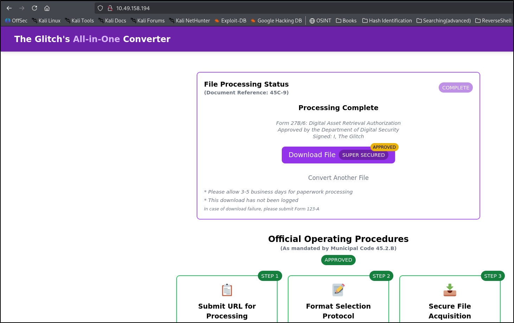
Such websites are often dangerous due to:

* Malvertising → Malicious ads that can infect systems
* Phishing → Fake offers or surveys to steal user data
* Bundled Malware → Hidden malicious files disguised as downloads

## File Download & Extraction : 


After converting a video, a file named download.zip was downloaded.  
On extracting, we found:
* song.mp3 → Legitimate audio file
* somg.mp3 → Suspicious file (note the spelling !!!)  

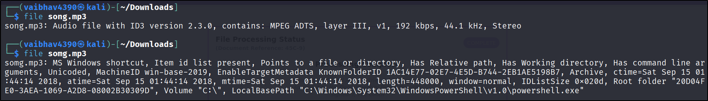

## Analyzing Files : 

Using the file command :


* song.mp3 → Normal MP3 audio file   
* somg.mp3 → MS Windows Shortcut (.lnk file) 

-->  This is a trick where a malicious file is disguised as an MP3.

## Investigating the Malicious File : 

Using ExifTool, we inspected the .lnk file and found a hidden PowerShell command.

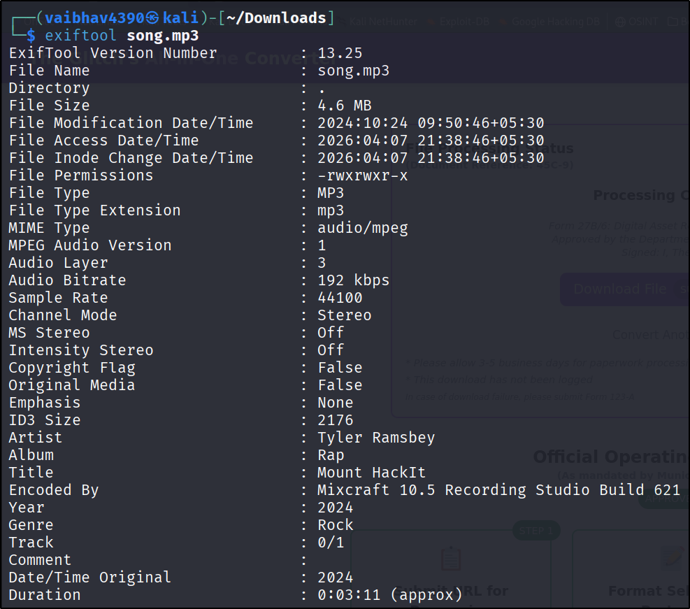
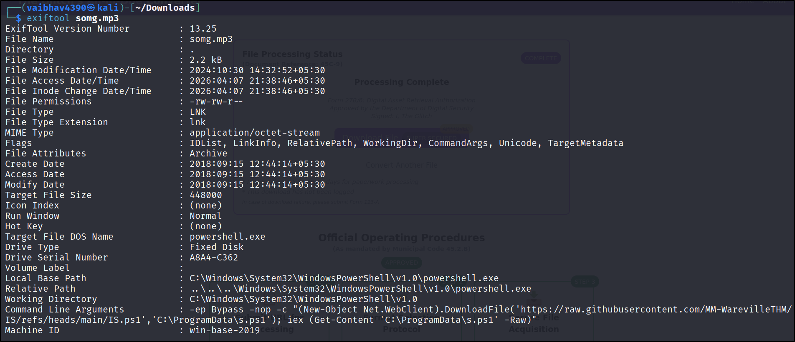

**What the Command Does**:  
- Bypasses PowerShell security restrictions.
- Downloads a script from a remote server.
- Saves it locally.
- Executes it silently.

## Malware Behavior : 
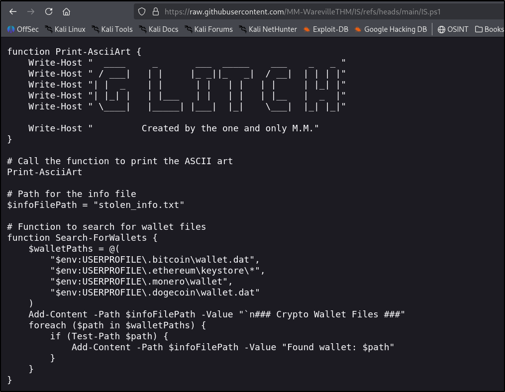
The downloaded PowerShell script performs:

* Searches for cryptocurrency wallet files.
* Attempts to collect saved credentials.
* Stores or sends stolen data to attacker.

--> This is a classic information stealer malware

## Key Clue :

Inside the script, a signature was found:

"Created by the one and only M.M."

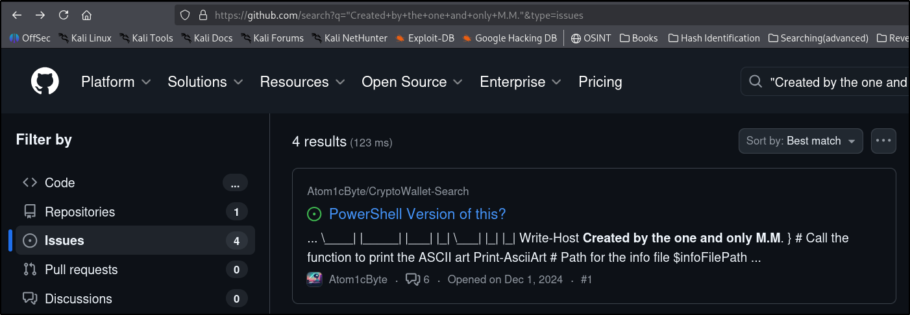

## Open Source Intelligence (OSINT) : 

Instead of only analyzing the malware, we searched this unique string online (GitHub).

* What we found:
* Related repositories and discussions
* GitHub Issues where the attacker interacted
* Reused username/handle

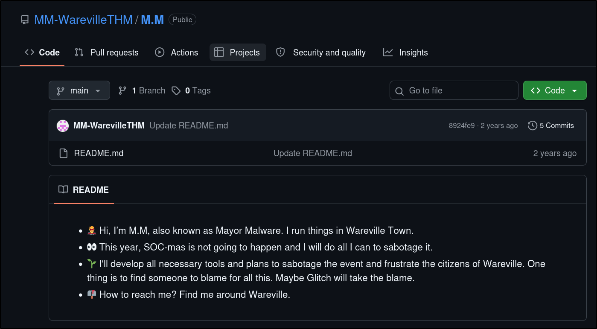
## OPSEC Failure : 

The attacker made mistakes in Operational Security (OPSEC).

**Common OPSEC Mistakes :**
* Reusing usernames across platforms.
* Leaving signatures in code.
* Posting publicly about malicious projects.
* Exposing metadata or personal info.

## Conclusion : 

This exercise showed how a fake converter website was used to distribute malware.
However, due to poor OPSEC, the attacker left behind clues that made it possible to uncover their identity.

**Answer the questions below :**

Q-1 Looks like the song.mp3 file is not what we expected! Run "exiftool song.mp3" in your terminal to find out the author of the song. Who is the author? 
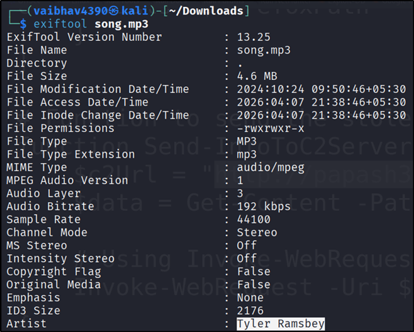
```
Tyler Ramsbey
```
Q-2 The malicious PowerShell script sends stolen info to a C2 server. What is the URL of this C2 server?
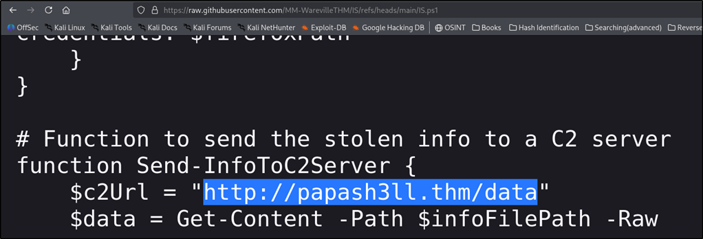
```
http://papash3ll.thm/data
```
Q-3 Who is M.M? Maybe his Github profile page would provide clues?
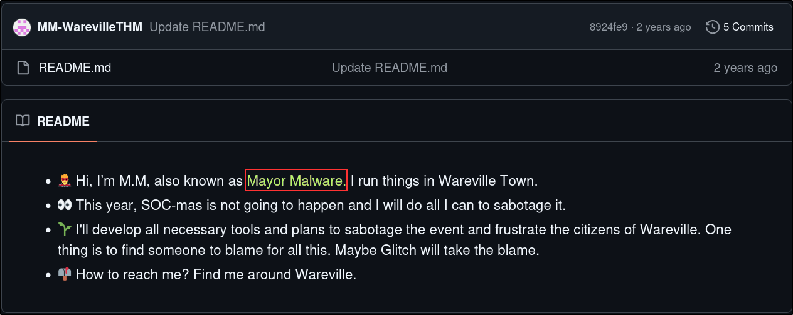
```
Mayor Malware
```
Q-4 What is the number of commits on the GitHub repo where the issue was raised?
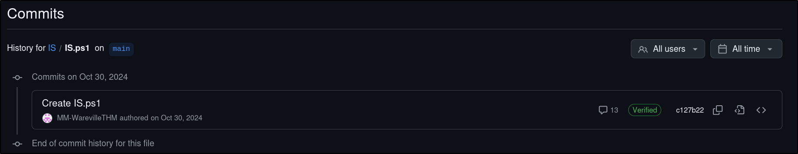
```
1
```
Q-5 If you enjoyed this task, feel free to check out the OPSEC room!
```
No Answer Needed
```
Q-6 What's with all these GitHub repos? Could they hide something else?
```
No Answer Needed
```


