# Log Analysis 
Log analysis is the process of reviewing system logs to detect issues, monitor activity, and improve security and performance.

## Day-2: ONe man's false positive is another man's popourri
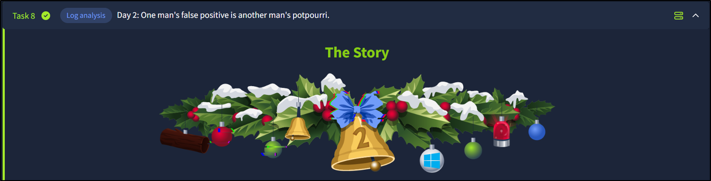

**Objective :**  
Analyze suspicious activity in Elastic SIEM to determine whether it is malicious or legitimate using logs, filters, and decoding techniques.

## Step 1: Accessing Elastic SIEM

-> Open the SIEM dashboard:  
```
https://LAB_WEB_URL.p.thmlabs.com
```
-> Login credentials:  
* Username: elastic.
* Password: elastic.

-> Navigate to:
* ☰ Menu → Discover Tab.


## Step 2: Setting the Timeframe
-> Incident reported between:
* Dec 1, 2024
* 09:00 – 09:30

--> Result: ~21 events found

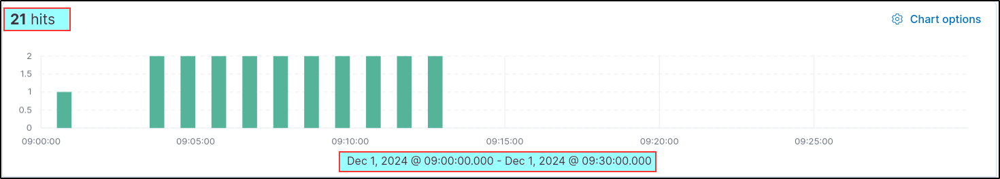

## Step 3: Making Logs Readable

-> Default logs are messy → Add useful columns:

-> Important Fields:
* host.hostname → Machine name.
* user.name → User performing action.
* event.category → Type of event.
* process.command_line → Executed command.
* event.outcome → Success/Failure.

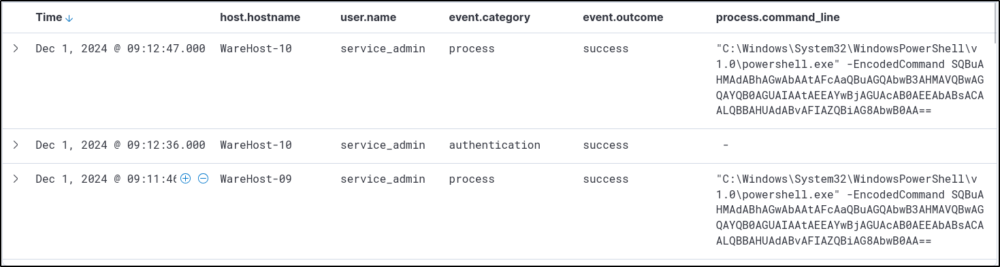

--> This makes analysis structured and readable.

## Step 4: Initial Findings
-> Same encoded PowerShell command executed on multiple machines
-> Each execution is preceded by:
* Successful login
* Suspicious Indicators:
    * Use of generic admin account
    * Admins were not present
    * Very precise timing pattern

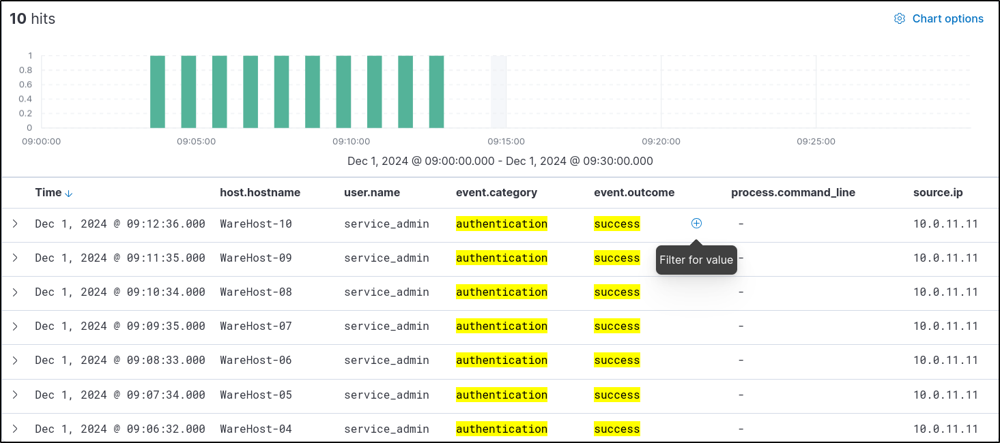

--> Strong sign of automated or scripted activity like brute-force attack.

## Step 5: Identifying the Source

-> Add another field:
* source.ip → Source of login

**Observation:**
Same IP involved in multiple actions..  
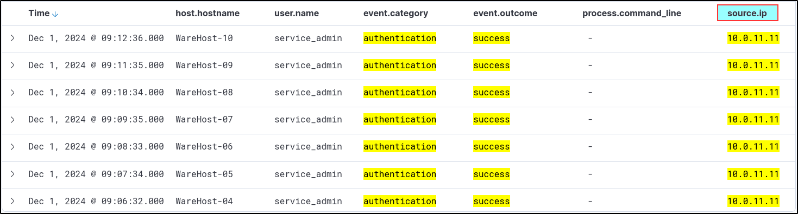

## Step 6: Filtering Logs
-> Key Filtering Techniques:
* Filter only authentication events:
    * Use +  on event.category
* Remove filters:
    * Click X

## Step 7: Expanding Time Range

To get full context:
* Set timeframe:
    * Nov 29 – Dec 1

* Findings:
    * ~6800+ events  

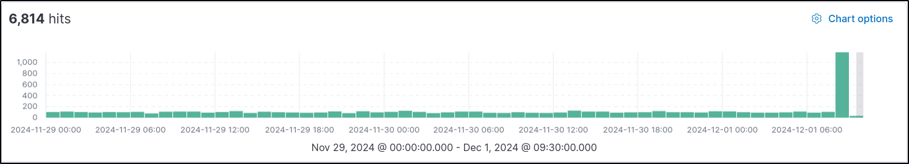

**Observation :** Huge boom near Dec 1
Many authentication attempts before attack..

## Step 8: Narrowing Down

-> Apply filters:

* user.name: service_admin
* source.ip: 10.0.11.11

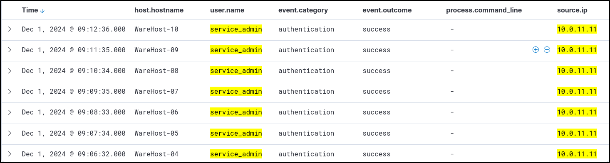

**Result:**
Continuous activity from same user & IP.

## Step 9: Detecting Brute Force Attack
-> Strategy:
* Filter:
    * Authentication events
    * Remove known IP
* Findings:
    * Large number of: Failed login attempts
    * New suspicious IP: Ends with .255.1

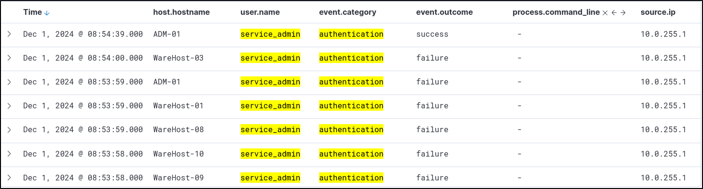

--> Classic brute-force pattern

## Step 10: Attack Success Confirmation
* Failed logins → followed by:
    * Successful login.
* Immediately followed by:
    * PowerShell execution.

--> **This confirms:** Attacker gained access and executed commands

## Step 11: Analyzing PowerShell Command
Encoded Command:
```
powershell.exe -EncodedCommand SQBuAHMAdABhAGwAbAAtAFcAaQBuAGQAbwB3AHMAVQBwAGQAYQB0AGUAIAAtAEEAYwBjAGUAcAB0AEEAbABsACAALQBBAHUAdABvAFIAZQBiAG8AbwB0AA==
```
Decoded Part - 
```
Install-WindowsUpdate -AcceptAll -AutoReboot
```

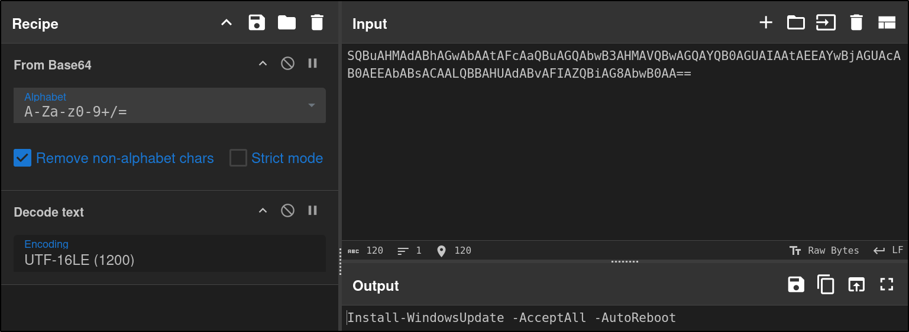

## Step 13: Shocking Discovery
Command was NOT malicious.It was:Running Windows Update,Fixing system issues..


## Step 14: Final Analysis
-> What Actually Happened:
* Script had expired credentials.

->Caused:
* Repeated failed logins (previous days)
* Someone:
    * Brute-forced access.
    * Fixed credentials.
    * Ran update commands.

---

**Answer the questions below :**  
Q-1 What is the name of the account causing all the failed login attempts?
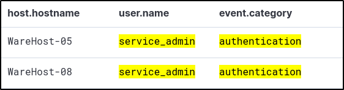
```
service_admin
```
Q-2 How many failed logon attempts were observed?
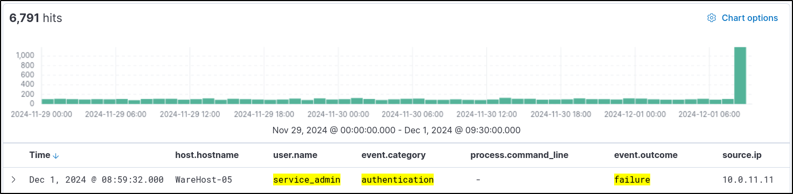)
```
6791
```
Q-3 What is the IP address of Glitch?
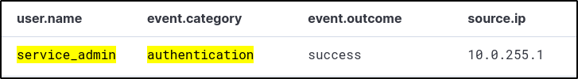
```
10.0.255.1
```
Q-4 When did Glitch successfully logon to ADM-01 ?  

```
Dec 1, 2024 08:54:39.000
```
Q-5 What is the decoded command executed by Glitch to fix the systems of Wareville?

```
Install-WindowsUpdate -AcceptAll -AutoReboot
```
Q-6 If you enjoyed this task, feel free to check out the Investigating with ELK 101 room.
```
No Answer Needed
```