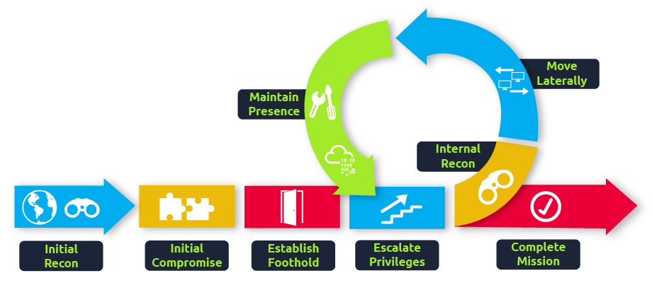
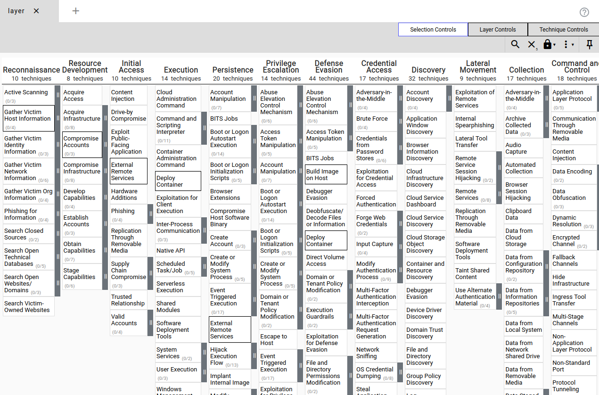
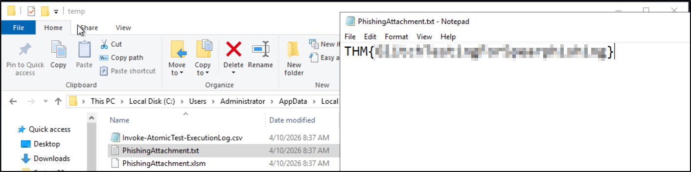
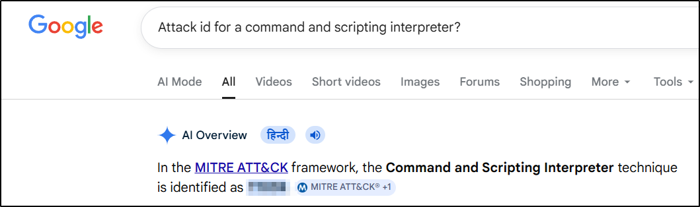
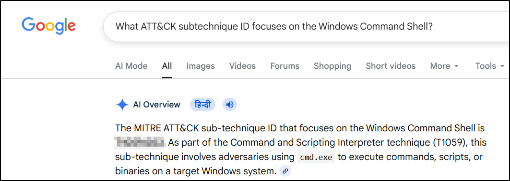
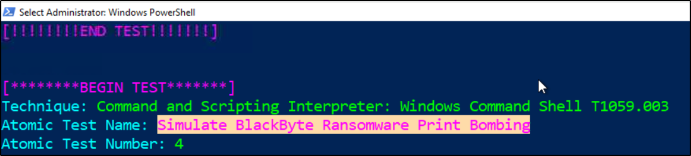
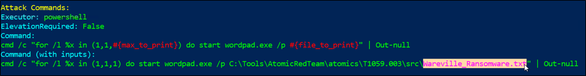
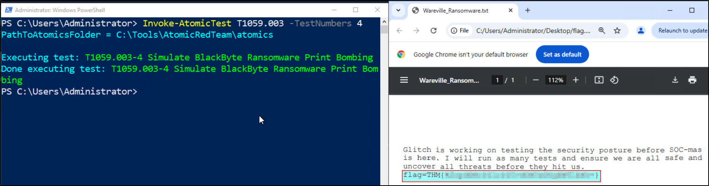

# Atomic Red Team 


## Day-4: I'm all atomic inside!
Day 4, focuses on Detection Gaps and how blue teams can identify and reduce them using:
* MITRE ATT&CK Framework
* Atomic Red Team
* Sysmon + Event Logs
* Custom detection rules (Sigma)

Instead of just attacking, this lab teaches how to simulate attacks and detect them effectively.
 
## Our Objectives
* Understand what detection gaps are.
* Learn about the Cyber Kill Chain.
* Use Atomic Red Team to simulate attacks.
* Analyze logs using Sysmon & Event Viewer.
* Create detection rules using Sigma.

### What are Detection Gaps?
Detection gaps are blind spots in security monitoring.  
-> Reasons:
Attackers constantly evolve techniques (cat-and-mouse game) and it's hard to differentiate between normal vs malicious behavior..

-> For Example:
* Login from EU seems to be suspicious, but could be CEO traveling be normal?

## Cyber Kill Chain
Every attack follows stages :   
**(Recon → Initial Access → Execution → … → Goal)**


-> Key-Idea:

* You don’t need to detect everything early —
* You just need to detect the attacker before final impact.

## MITRE ATT&CK

A framework that maps:
* Tactics (why)
* Techniques (how).

Example used in lab:
* T1566.001 -> Spearphishing Attachment.

## Atomic Red Team
It's a  library of real attack simulations mapped to MITRE ATT&CK.  
-> It is Used to:
* Test detection rules
* Identify gaps
* Improve SOC visibility

## Practical - 
### Step 1: Explore Atomic Tests

Command To Use :
```
Get-Help Invoke-AtomicTest
```
This shows parameters like:

- ShowDetails.
- TestNumbers.
- CheckPrereq.
- Cleanup.

### Step 2: View Attack Details
```
Invoke-AtomicTest T1566.001 -ShowDetails
```
This reveals:

- Attack description.
- Commands executed.
- File paths.
- Cleanup steps.

### Step 3: Run Atomic Test (Phishing Simulation)
Checking prerequisites:
```
Invoke-AtomicTest T1566.001 -TestNumbers 1 -CheckPrereq
```
Run the attack:
```
Invoke-AtomicTest T1566.001 -TestNumbers 1
```
--> What happens:
PowerShell downloads a malicious file and it's saved in **%TEMP%\PhishingAttachment.xlsm**.

### Step 4: Log Analysis (Sysmon)
What to do?

* Open Event Viewer
* Navigate:
    * **Applications -> Microsoft -> Windows -> Sysmon -> Operational**
    * Clear logs.
    * Re-run the attack.
    * Refresh the logs.


### Key Indicators Found
1. Process Creation - 
* PowerShell executed:
* Invoke-WebRequest
2. File Creation - 
* PhishingAttachment.xlsm

--> These are Indicators of Compromise (IOCs)

### Answer the questions below
Q-1 What was the flag found in the .txt file that is found in the same directory as the PhishingAttachment.xslm artefact?

```
THM{GlitchTestingForSpearphishing}
```
Q-2 What ATT&CK technique ID would be our point of interest?

```
T1059
```
Q-3 What ATT&CK subtechnique ID focuses on the Windows Command Shell?

```
T1059.003
```
Q-4 What is the name of the Atomic Test to be simulated?

```
Simulate BlackByte Ransomware Print Bombing
```
Q-5 What is the name of the file used in the test?

```
Wareville_Ransomware.txt
```
Q-6 What is the flag found from this Atomic Test?

```
THM{R2xpdGNoIGlzIG5vdCB0aGUgZW5lbXk=}
```
Q-7 Learn more about the Atomic Red Team.
```
No Answer Needed
```

---
