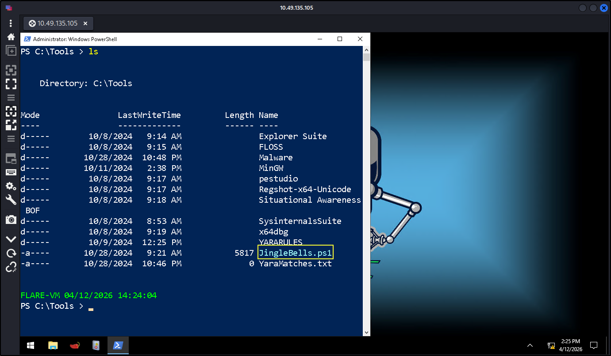
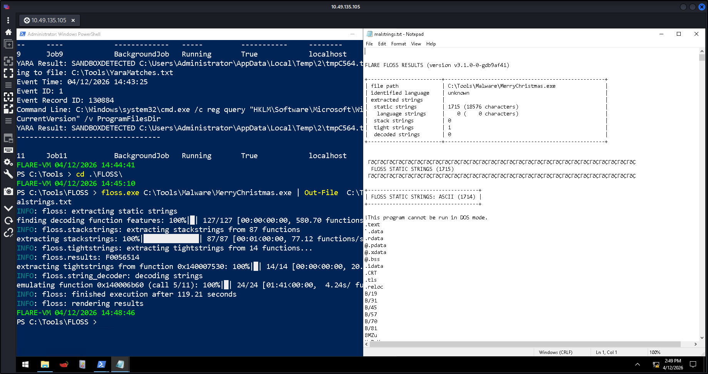
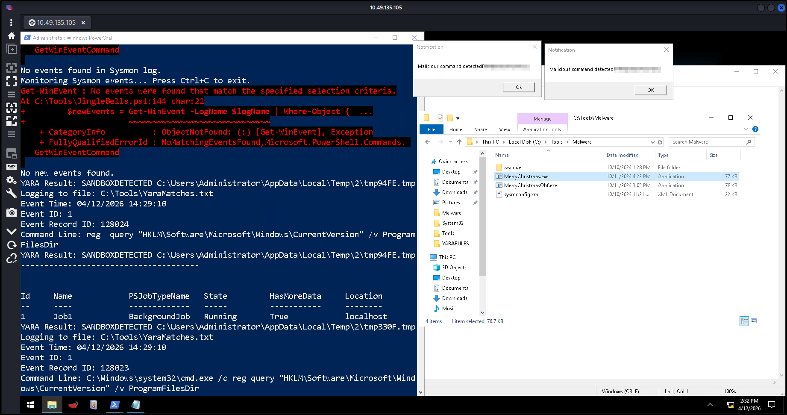
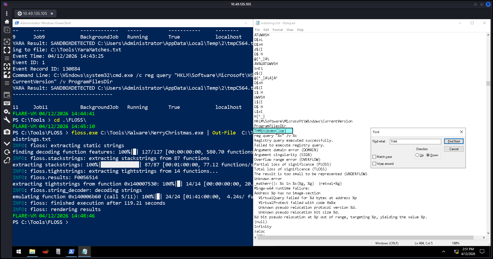

# Sandboxes :
A sandbox is a safe, isolated digital "playground" where we can run software or open files without any risk to our real computer or network.
- It prevents damage to the actual system.
- Security tools inside sandbox:
    - Monitoring tools
    - Logging systems
    - Behavior analysis tools

--> Malware often checks if it’s inside a sandbox before executing.

## - Day 6 - "If I can't find a nice malware to use, I'm not going"

###  Sandbox Detection Technique
-> Registry Check Method :

Malware checks if this registry path exists :
```
HKLM\Software\Microsoft\Windows\CurrentVersion
```
Specifically looks for :
```
ProgramFilesDir 
``` 
-> Why?
- Real systems -> This value exists
- Sandbox/VM -> Often missing or different

--> If missing -> malware assumes it's in a sandbox and stops execution

### **C** Code Behavior :)
It runs a command :
```
reg query "HKLM\Software\Microsoft\Windows\CurrentVersion" /v ProgramFilesDir
```
-> If command works then it is a normal system.  
-> If not then it's likely a sandbox. 

--> Key idea: Malware uses system checks before attacking


### Introduction to YARA
-> YARA is used to: 
- Detect malware and Match patterns like - strings, behavior, file traits.

-> Example Rule Logic
- Detects registry query command

Key Components:

- strings -> what to look for
- condition -> when to trigger

--> If pattern matches → malware is flagged

### EDR + YARA Monitoring :
-> Custom script (JingleBells.ps1) monitors:
- Sysmon logs
- Runs YARA rules on events
-> Workflow:
1. Starting monitoring script.
2. Then running the malware.
3. The script detects registry query.
4. Alert + log stored in:
```
C:\Tools\YaraMatches.txt
```

### Evasion via Obfuscation
-> Technique Used:
- Encoding command using Base64.
- Executing via PowerShell.

Example:
```
powershell -EncodedCommand <base64_string>
```
--> Same action, but hidden which become much harder to detect with **YARA** rules.

### Limitation of Obfuscation
-> Tool: FLOSS
- It was developed by Mandiant and It extracts hidden/encoded strings from malware.
-> Usage:
```
floss.exe <malware.exe> | Out-file malstrings.txt
```

-> Outcome:
- Reveals hidden strings
- Helps analysts detect obfuscated malware



--> Lesson: Obfuscation ≠ invisibility

### Using YARA with Sysmon Logs : 
-> Sysmon logs are detailed system activity:
- Process creation
- Network activity

-> File changes
- Focus Event:
Event ID 1  Process Creation 

**Investigating Logs**

-> Step 1: Check YARA log
```
C:\Tools\YaraMatches.txt
```

**Important fields:**

1. Event ID
2. Event Record ID
3. Command Line

-> Step 2: Filter in Event Viewer

Use XML query:
```
<QueryList>
  <Query Id="0" Path="Microsoft-Windows-Sysmon/Operational">
    <Select Path="Microsoft-Windows-Sysmon/Operational">
      *[System[(EventRecordID="YOUR_ID_HERE")]]
    </Select>
  </Query>
</QueryList>
```

### **Answer the questions below**
Q-1 What is the flag displayed in the popup window after the EDR detects the malware?

```
THM{GlitchWasHere}
```
Q-2 What is the flag found in the malstrings.txt document after running floss.exe, and opening the file in a text editor?

```
THM{HiddenClue}
```
Q-3 If you want to more about sandboxes, have a look at the room FlareVM: Arsenal of Tools.
```
No Answer Needed
```
---

